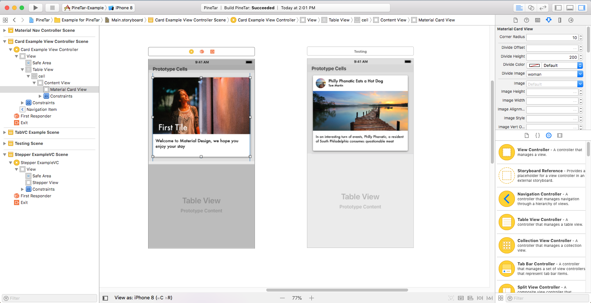

#  PineTar

An iOS material design library (plus other useful UI/UX features) that utilizes the IBDesingable and IBInspectable tools to help visualize and easily manipulate your UI on iOS Storyboards.

<div align="center">
 
</div>

<div align="center">
 
 
 
<iframe src='https://gfycat.com/ifr/FlashyLeadingCattle' frameborder='0' scrolling='no' width="30%"></iframe>
</div>

## Installing

### CocoaPods

[CocoaPods](http://cocoapods.org) is a dependency manager for Cocoa projects. You can install it with the following command:

```bash
$ gem install cocoapods
```

> CocoaPods 1.1+ is required to build PineTar.

To integrate PineTar into your Xcode project using CocoaPods, specify it in your `Podfile`:

```ruby
source 'https://github.com/CocoaPods/Specs.git'
platform :ios, '10.0'
use_frameworks!

target '<Your Target Name>' do
pod 'PineTar'
end
```

Then, run the following command:

```bash
$ pod install
```

### Manually
If you prefer not to use either of the aforementioned dependency managers, you can integrate PineTar into your project manually.

## Usage
Download the project and run the samples or use the following docs to get started

We are still just starting! Use what we have and contribute what you need
* [Themes](https://github.com/diamondkinetics/PineTar/blob/master/Documentation/Themes.md)
* [Tabs](https://github.com/diamondkinetics/PineTar/blob/master/Documentation/Tabs.md)
* [Cards](https://github.com/diamondkinetics/PineTar/blob/master/Documentation/Cards.md)
* [Card Table Views](https://github.com/diamondkinetics/PineTar/blob/master/Documentation/CardTableViews.md)
* [Steppers](https://github.com/diamondkinetics/PineTar/blob/master/Documentation/Steppers.md)

## Contributing

This is a young project with plenty of room for growth and improvement. Feel free to contribute with in any of the following ways
* **Feature Requests** Open an issue
* **Bugs:** Open an issue
* **Code:** Submitting a pull request

## Authors

* **Thomas Martin** - [tdmartin4](https://github.com/tdmartin4)

## License

PineTar is available under the MIT license. See the LICENSE file for more info.

## Acknowledgments

* Thanks to [SnapKit](https://github.com/SnapKit/SnapKit) for making my life easier
